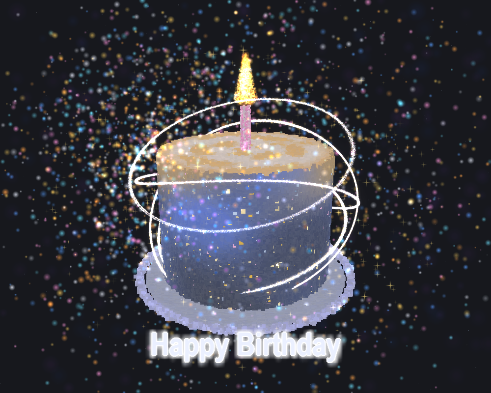

# Happy Birthday —— 3D 粒子生日蛋糕

一个用纯粒子堆出来的 3D 生日蛋糕。整个画面（蛋糕、盘子、飘带、火焰、蜡烛、纸屑、星云）都是点，没有任何一个三角形、没有一张模型贴图，也**没有一行 GLSL 着色器** —— 全程走 OpenGL 固定管线。



参考图是 `1.png`，下面很多参数都是对着它一点点量的。

---

## 运行

```
pip install pygame PyOpenGL numpy
python birthday_cake.py
```

> **Python 3.13 及以上**：官方 `pygame` 还没有对应的 wheel，装 `pygame-ce`（`pip install pygame-ce`）即可，它提供的模块名同样是 `pygame`，代码不用改。

调试用的截图模式 —— 渲染 90 帧后存 `preview.png` 并退出，不用开着窗口：

```
python birthday_cake.py --shot
```

## 操作

| 操作 | 效果 |
|---|---|
| 鼠标左键拖动 | 旋转视角 |
| 鼠标滚轮 | 缩放视角 |
| `ESC` / 关闭窗口 | 退出 |

---

## 实现要点

### 全部是点

每个系统是一组粒子，位置和颜色各一个 VBO，用 `glVertexPointer` / `glColorPointer` / `glDrawArrays(GL_POINTS)` 画出来。粒子大小不同时按大小分档，每档一次 `glPointSize` + `glDrawArrays`。每帧要动的系统用 `glBufferSubData` 更新。

当前粒子总数 **216760**：

| 部分 | 数量 | 部分 | 数量 |
|---|---:|---|---:|
| 蛋糕 | 82000 | 纸屑 | 3000 |
| 光环 | 95000 | 星星 | 1500 |
| 底盘 | 28000 | 星云 | 900 |
| 火焰 | 5200 | 蜡烛 | 700 |

### 两种完全不同的画法

- **实体面**（蛋糕、盘子、蜡烛）：不贴图的方点，关掉 `GL_POINT_SMOOTH`，用 `GL_LESS` + 写深度 + 覆盖式混合，alpha 预先乘进 RGB。一个像素基本只有一颗粒子说话，亮度纯粹来自粒子自己的颜色。`GL_LESS` 不能改成 `GL_LEQUAL`，否则最外面那层薄壳会过曝。
- **发光物**（光环、火焰、纸屑、星云）：柔光球贴图 + 加法混合（`GL_SRC_ALPHA, GL_ONE`），不写深度但**照常接受深度测试**，所以蛋糕后面那半圈还是会被正确遮掉。

### 不用着色器做辉光

离屏 FBO 渲染 → 亮度阈值提取 → 小半径可分离高斯模糊（同一张图按纹理矩阵偏移画很多遍累加，近层半分辨率）→ 叠加回屏幕。

亮度提取那一步是两个混合方程凑出来的：

```
bright = clamp(scene * GAIN - THRESHOLD, 0, 1)
```

用 `glBlendFunc(GL_ONE, GL_ONE)` 配 `glBlendEquation(GL_FUNC_REVERSE_SUBTRACT)`。

有一点容易踩：**合成是加法不是插值**（`a0*原图 + a1*近层 + a2*远层`），所以任何亮过阈值的像素都会**变亮**，不只是"多一圈光晕"。阈值给低了整张图会糊掉。

### 飘带是行波，不是随机抖

光环一开始是用 `ParticleSystem` 那套"每颗粒子随机频率上下抖"来做浮动的，结果 95000 颗粒子各抖各的，屏幕上只是一层毛边，动起来像在嗡嗡震。

现在改成：每颗粒子的 `θ`、所在轨道面的倾角、基准半径/高度都存进 `anim`，每帧由 `ring_animate()` 重算 —— 同一条环在同一时刻只有一个相位，波峰沿着弧长以固定速度往前跑。这才是"带子在飘"。

另外，环的粗细**必须让几何厚度超过粒子贴图**（贴图 2~4 像素）。原先 `RING_WIDTH = 0.0045` 折算到屏幕上不到 1 像素，比贴图还窄，于是环的厚度完全由贴图决定 —— 几何上再怎么提按，屏幕上都看不出粗细变化，只剩亮度在变。

---

## 调参

配置区集中在文件开头的 `① 配置区`，注释里写了每个值为什么取这个数、上下限在哪里。几个最常动的：

| 常量 | 作用 |
|---|---|
| `ROT_SPEED` / `RING_SPIN` | 蛋糕和光环的自转速度（后者为负 = 反向转） |
| `RING_WAVE_AMP` / `RING_WAVE_SPEED` | 飘带起伏的幅度和跑的速度 |
| `RING_WIDTH` / `RING_COUNT` | 飘带基准粗细和点数（**这两个是一对**，调粗了点数要跟着加，否则会断成珠子） |
| `BLOOM_THRESHOLD` / `BLOOM_GAIN` | 辉光阈值和增益 |
| `BLOOM_W_ORIGINAL` / `_NEAR` / `_FAR` | 原图 / 近层 / 远层的合成权重 |
| `BG_COLOR` | 背景底色（对照 `1.png` 量的，约 0.11 的蓝灰，不是纯黑） |

## 已知限制

- 画面本质是一团点，**凑近看是颗粒**。参考图是手绘插画，笔触那种平滑感在粒子方案里做不出来，只能靠加密度逼近。
- 飘带的几何是静态烘好的起伏 + 每帧位置重算，没有做形变。
- 全屏 216760 个点的实测开销：`ring_animate` 中位 0.93 ms / p95 1.10 ms（60 fps 的预算是 16.67 ms）。粒子数再往上加，第一个顶不住的是加法混合的填充率，不是顶点。

---

## 文件

```
birthday_cake.py   主程序（单文件，配置 + 粒子生成 + 渲染全在里面）
1.png              参考图
preview.png        --shot 渲染出来的效果图
```
